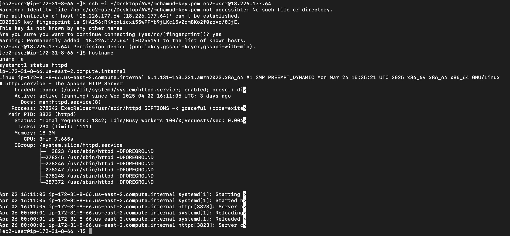

# EC2 Web Server with Apache

## Overview
This project involved launching an EC2 instance on AWS, connecting to it via SSH, installing Apache, and hosting a live website. The goal was to demonstrate the ability to manage virtual servers and deploy web content manually.

## What I Did
- Launched a t2.micro EC2 instance using Amazon Linux
- Configured security group to allow SSH and HTTP
- Connected to the instance using SSH and a key pair
- Installed and started Apache web server
- Created a custom `index.html` page
- Accessed the page from a browser using the instance’s public IP

## Skills Demonstrated
- EC2 instance creation and configuration
- Using SSH and key pairs securely
- Installing software on Linux via terminal
- Basic web hosting on AWS

## Why It Matters
EC2 is a foundational AWS service. Being able to deploy, connect, and host content proves readiness for real-world cloud roles involving infrastructure setup and management.
## Screenshot

The image below shows my EC2 instance running Apache, proving successful setup and connection:

