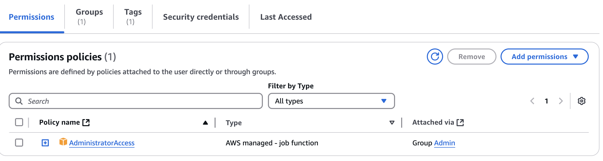

# IAM User & Policy Setup

## Overview
This project demonstrates how to create IAM users and groups in AWS, assign policies using least privilege access, and test permissions through real login scenarios.

## What I Did
- Created a new IAM user and group
- Attached the `AmazonS3ReadOnlyAccess` policy to the group
- Logged in as the user to verify they could view S3 but not upload/delete
- Practiced access denial and learned how policies affect what users can do

## Skills Demonstrated
- IAM users and group creation
- Attaching managed policies
- Applying and testing least privilege
- Understanding permission boundaries

## Why It Matters
IAM is a core AWS service used to manage security and access. Every cloud role needs to understand how IAM controls access to AWS resources securely and properly.
## Screenshots

These screenshots show the IAM user (`mohamud`) with attached permissions and group membership:

### User Permissions

### Group Membership

