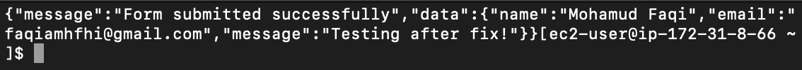

# Lambda Contact Form (Project 4)

## Overview
This project demonstrates how to build a serverless contact form using AWS Lambda and API Gateway. When a user submits the form, it triggers a Lambda function to process and log the message.

## Architecture
- AWS Lambda (Node.js) to process form data
- API Gateway to trigger the Lambda from a public endpoint
- IAM role for Lambda execution permissions
- (Optional) SES to send the message via email

## Why It Matters
Serverless architecture is cost-efficient and scalable. This shows I can build real-world, backend-powered apps without provisioning servers.

## Screenshot

Successful response after posting data to my Lambda function:

