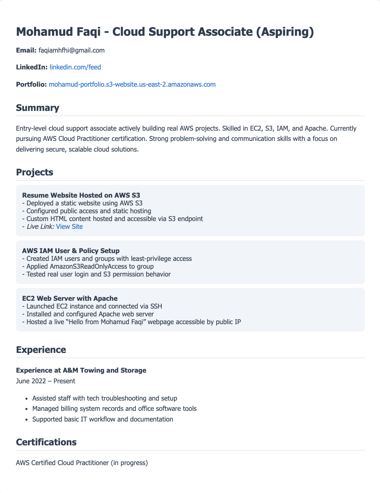

# S3 Resume Website

## Overview
A static resume website hosted on AWS S3. This project demonstrates the use of AWS S3 static website hosting, public access permissions, and clean HTML portfolio design.

## Skills Demonstrated
- S3 bucket setup and configuration
- Static website hosting and permissions
- Understanding of public access settings
- Front-end portfolio structure

## Live Website
[View the site](http://mohamud-portfolio.s3-website.us-east-2.amazonaws.com)
## Screenshot

Here’s a full-page preview of the live resume website hosted on AWS S3:

